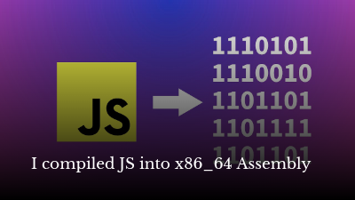

# MuJS Compiler

Small subset of ES5 to x86_64 assembly based on [MuJS](https://mujs.com/).

## Quick Start

```console
$ cc -o nob nob.c
$ ./nob
$ cat ./examples/example.js
var a = 34;
var b = 35;
print_int(a);
a += b;
print_int(a);
$ ./build/mujsc ./examples/example.js ./examples/example
$ ./examples/example
34
69
```

## Screencast

This project was originally started on a livestream:

[](https://www.youtube.com/watch?v=7uVhfiwcWZ8)
